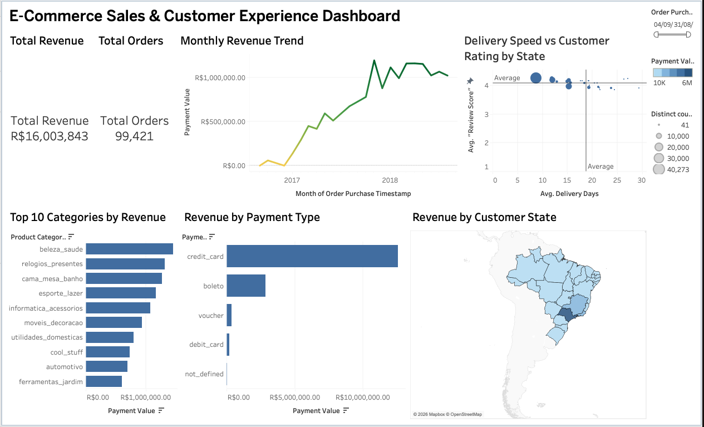

# E-Commerce Sales & Customer Analytics (SQL + Python)

## About this project

This is a data analysis project I built using the Olist Brazilian E-Commerce dataset from Kaggle. The dataset has around 100,000 orders placed between 2016 and 2018, across customers, sellers, products, payments and delivery details.

I wanted to actually practice SQL beyond just basic SELECT and GROUP BY, so I loaded all the CSV files into a MySQL database and wrote queries directly against it, then pulled the results into Python with pandas for the visualizations. It ended up covering 21 different questions, ranging from simple counts to window functions and a basic retention analysis.

## Dataset

[Olist Brazilian E-Commerce Dataset on Kaggle](https://www.kaggle.com/datasets/olistbr/brazilian-ecommerce)

The dataset is split across multiple CSV files (customers, orders, sellers, products, payments, order items, geolocation) which I loaded into a local MySQL database and joined together as needed.

## Tools used

- MySQL for storing the data and writing the SQL queries
- Python (pandas, matplotlib, seaborn, squarify) for pulling results and making charts
- Jupyter Notebook to keep the queries, code and charts together

## What this covers

The notebook is split into 21 sections. Some examples of what I looked at:

- Most frequently purchased products and top selling categories
- Number of sellers and average delivery time by state
- Percentage of orders paid in installments, and whether installments relate to order value
- Correlation between product price and how often it gets purchased
- Spend tier distribution (grouping orders into Very Low to Very High spenders)
- Top sellers per category using dense rank
- Top 3 highest spending customers per year
- Month on month and year over year sales growth
- Moving average of order value per customer
- Statewise delivery performance (early, on time, late)
- Customer retention rate (whether people come back and order again within 6 months)

Each section has the SQL query, the result as a dataframe, and a chart where it made sense to add one instead of just a raw table.

## Key findings

Going through all the sections above, a few things stood out to me the most:

1. Customer retention is really low, only 2.32% of people who ordered once came back and bought again within 6 months. Most customers on this platform are one time buyers, not repeat ones.

2. Delivery speed depends a lot on location. Customers in SP get their orders in about 8.7 days on average, while customers in RR wait around 29 days, that is more than 3 times longer for basically the same platform.

3. Installments do affect order value. There is a moderate positive correlation (0.57) between the number of installments and the average order value, so people tend to split bigger purchases into more installments instead of paying smaller ones over time.

4. Sellers are heavily concentrated in one state. Out of around 3,095 total sellers, close to 60% are based in SP alone, so the seller base is not spread out evenly across Brazil.

5. Most orders fall in the medium spend range. 42% of delivered orders land in the 100 to 300 payment range, while high and very high spend orders combined make up only about 10% of all orders, so big ticket purchases are the exception, not the norm.

## Dashboard
 
I also built a Tableau dashboard on top of the same dataset, mainly to practice presenting the numbers visually instead of just as SQL output. You can check it out here:
 
[E-Commerce Sales & Customer Experience Dashboard](https://public.tableau.com/app/profile/rishav.raj8601/viz/Book1_17854435558740/Dashboard1?publish=yes&showOnboarding=true)
 
The dashboard has two KPI cards at the top showing total orders and total revenue, which update automatically depending on what state you click on the map, since I set up a filter action between the map and the rest of the dashboard. Below that there is a monthly revenue trend line, a bar chart of the top 10 product categories by revenue, and another bar chart showing revenue split by payment type (credit card, boleto, voucher, debit card).
 
There is also a map of Brazil colored by revenue per state, and a scatter plot comparing average delivery days against average customer review score for each state, with the size of each point based on how many orders came from that state. The idea behind that chart was to see if slower delivery actually results in lower ratings, which is something the SQL notebook does not really show since it treats delivery time and reviews separately.
 
A date filter on the side lets you narrow everything down to a specific time range across all charts at once.


## How to run this

1. Download the dataset from Kaggle and place the CSV files in a folder.
2. Set up a local MySQL server and create a database (I called mine `ecommerce`).
3. Update the `folder_path` variable in the notebook to point to wherever you saved the CSV files.
4. Run the notebook cells in order, the first few cells create the tables and load the data in, the rest are the actual analysis.

```
pip install pandas matplotlib seaborn mysql-connector-python squarify
```

## A few notes on the data

- Around 2,965 orders don't have a delivery date (they were never delivered), so those are excluded from delivery time calculations.
- 610 products don't have a category listed, those are excluded from category level queries.
- 2016 has very little data (only a few months), so it is left out of the growth rate comparisons since it skews the numbers.


**Rishav Raj**
